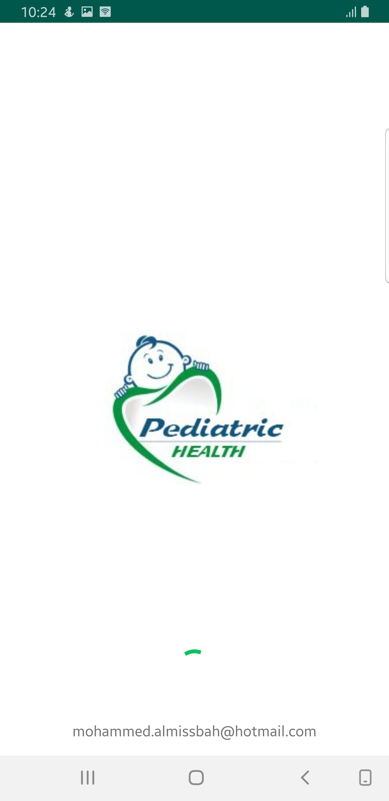
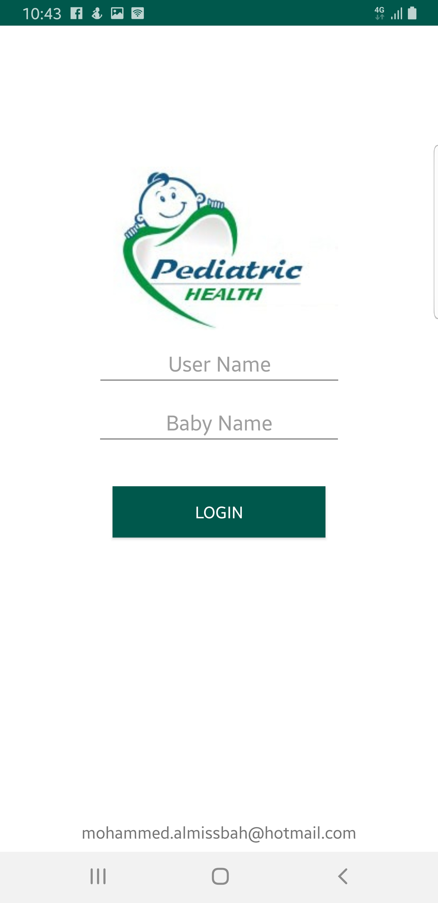
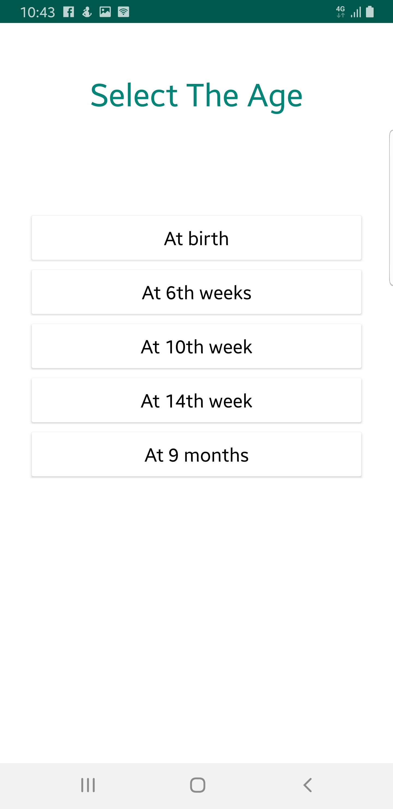
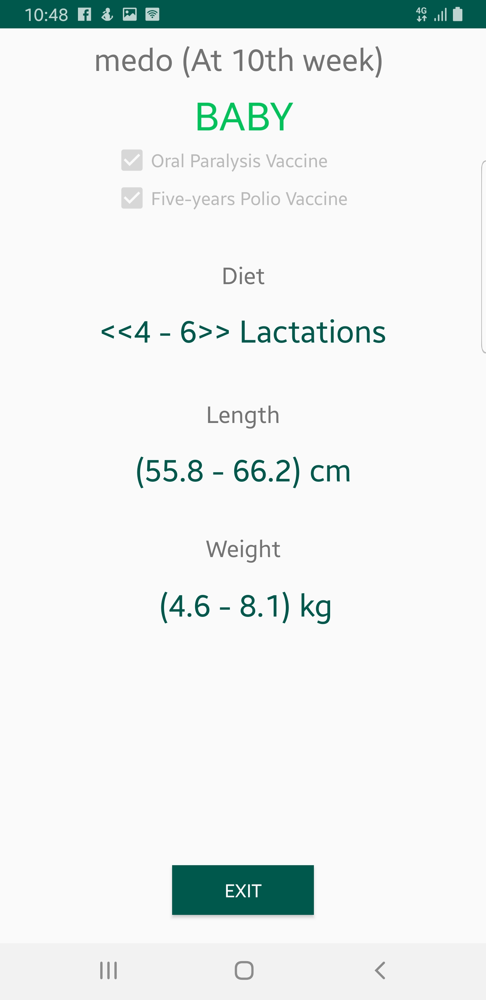

# Pediatric Health
This Application for monitoring babies weight, length and diet.

## ScreenShots:

     
 

------

## App Features
1. User can add his baby.
2. User can recives notifications in the right time for vaccinations.
3. User can know the perfect weigt of his child at his child age.

### The app includes the following main components:

* A local database that servers as a single source of truth for data presented to the user.
* A web api service.
* A repository that works with the database and the api service, providing a unified data interface.
* A ViewModel that provides data specific for the UI.
* The UI, which shows a visual representation of the data in the ViewModel.
* Unit Test cases for API service, Database, Repository and ViewModel.

### App Packages:
* **api**  contains the api classes to make api calls to server using Retrofit.
* **model** - contains model classes.
* **ui** - contains classes needed to display Activity and Fragment. 

### App Specs
* Minimum SDK 16
* Java8 (in master branch) 
* Android SharedPrefrences for storing user info.
* Retrofit 2 for API integration.
* Gson for serialisation.
------
## App links

* [App Server repository](https://github.com/Almissbah/pediatric-health-php)
